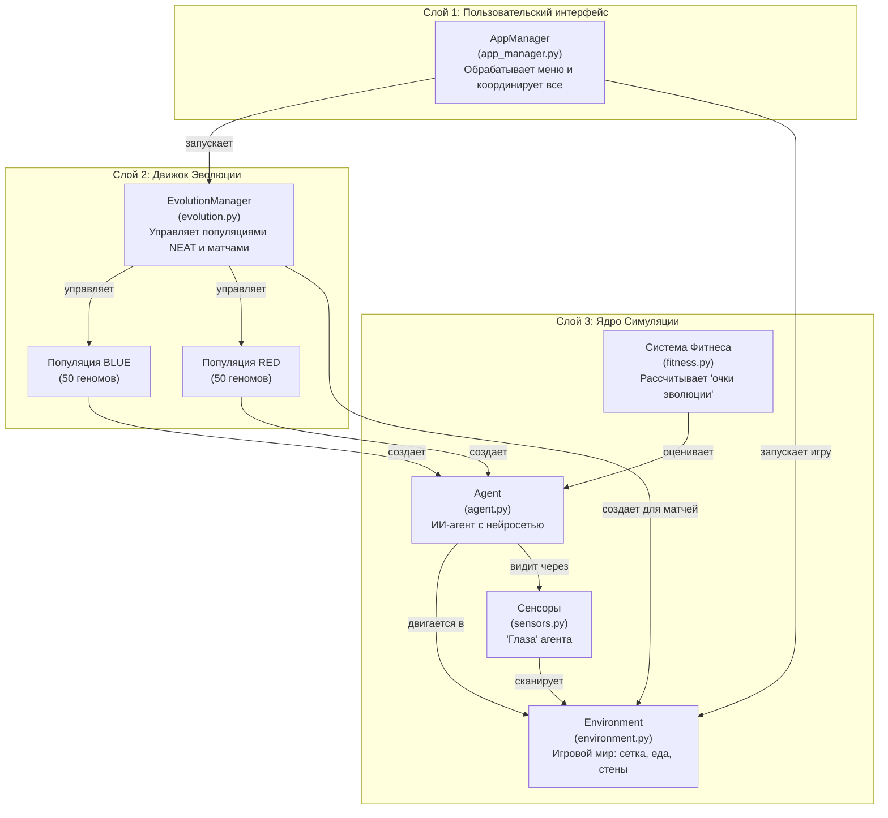

# Interactive Evolution AI Studio

Добро пожаловать в **Interactive Evolution AI Studio** — фреймворк для обучения нейронных сетей с помощью конкурентной коэволюции. В этой системе две популяции ИИ-агентов ("синие" и "красные") развиваются, соревнуясь друг с другом в 1v1 матчах на сетке. Цель — выжить, найти еду и перехитрить противника.

Этот документ — ваше полное руководство по проекту. Он написан так, чтобы быть понятным каждому, независимо от вашего уровня знаний в области ИИ.

---

## 🧠 Ключевые концепции для начинающих

Чтобы понять, что происходит "под капотом", давайте разберем три ключевые идеи простыми словами.

### 1. Нейроэволюция: Эволюция для "мозга" ИИ

Представьте, что вы не программируете ИИ, а "выращиваете" его, как растение.

- **Традиционный ИИ**: Программист пишет правила и настраивает нейронную сеть вручную.
- **Нейроэволюция**: Мы создаем популяцию случайных, очень "глупых" ИИ-агентов. Затем мы заставляем их соревноваться. Самые успешные (например, те, кто собрал больше еды) "размножаются", передавая свои черты следующему поколению. Худшие — вымирают.

Через сотни поколений этот процесс, подобный естественному отбору, "выращивает" сложный и эффективный ИИ без необходимости писать для него правила поведения вручную.

### 2. NEAT: "Умная" эволюция, которая усложняет мозг

**NEAT** (*NeuroEvolution of Augmenting Topologies*) — это особый, очень эффективный вид нейроэволюции. Его главная особенность в том, что он позволяет ИИ не только настраивать существующие связи в своем "мозге", но и **постепенно усложнять его структуру**.

- **Начало**: Агенты начинают с очень простых нейронных сетей (например, "вижу еду -> иду к ней").
- **Развитие**: В процессе эволюции NEAT может добавлять новые "нейроны" и "связи". Это позволяет агентам развивать более сложное поведение. Например, сначала агент учится есть, потом — избегать препятствий, а затем — обманывать врага, заманивая его в ловушку.

NEAT также делит популяцию на "виды" (species), защищая новые, перспективные мутации от вымирания, пока они не станут достаточно сильными.

### 3. Конкурентная Коэволюция: Гонка вооружений для ИИ

Что будет, если столкнуть две эволюционирующие популяции друг с другом? Получится **гонка вооружений**.

- В нашем проекте есть две команды: **Синие** и **Красные**.
- Синие агенты получают "очки эволюции" (фитнес), соревнуясь со случайными красными агентами.
- Красные агенты получают очки, соревнуясь со случайными синими.

Это создает бесконечный цикл улучшений:

1. Синие развивают успешную тактику (например, охранять еду).
2. Красные, чтобы выжить, вынуждены развивать контртактику (например, научиться отвлекать синих).
3. Синие, в свою очередь, должны адаптироваться к новой тактике красных.

Этот процесс позволяет достичь гораздо более сложного и устойчивого поведения, чем если бы агенты тренировались против статичного, не меняющегося противника.

---

## 🛠️ Ключевые технологии

Этот проект построен на нескольких ключевых библиотеках:

| Технология | Для чего используется |
|---|---|
| **NEAT-Python** | Основной движок нейроэволюции. Управляет популяциями, мутациями, скрещиванием и видообразованием. |
| **Pygame** | Библиотека для 2D-графики. Используется для визуализации матчей в реальном времени. |
| **Multiprocessing** | Стандартная библиотека Python для распараллеливания вычислений. Ускоряет тренировку в 10-20 раз, запуская матчи на всех ядрах процессора. |
| **Numba** | JIT-компилятор, который ускоряет числовые вычисления в Python до уровня C. Используется для критически важной оптимизации системы "зрения" агентов. |
| **NumPy** | Фундаментальная библиотека для научных вычислений. Используется для эффективных, векторизованных вычислений расстояний в системе наград (reward shaping). |
| **Rich** | Библиотека для красивого форматирования вывода в терминале. Отображает таблицы с метриками эволюции в реальном времени. |
| **Questionary** | Позволяет создавать интерактивные меню в командной строке. |
| **Pyperclip** | Обеспечивает кросс-платформенную работу с буфером обмена для копирования текста из панели логов в режиме визуализации. |
| **Torch** | Библиотека для глубокого обучения. Указана в зависимостях, но на данный момент активно не используется в коде. |

---

## 🚀 Руководство по быстрому старту

### Шаг 1: Установка

Для начала вам понадобится **Python 3.7** или новее.

1. **Клонируйте репозиторий:**

    ```bash
    git clone https://github.com/Sheme1/interactive-evolution-ai.git
    cd interactive-evolution-ai
    ```

2. **Установите зависимости:**

    ```bash
    pip install -r requirements.txt
    ```

### Шаг 2: Запуск

Запустите приложение из корневой папки проекта:

```bash
python main.py
```

Вы увидите главное меню в вашем терминале.

---

## 🧭 Как это работает: Путеводитель по меню

Приложение управляется через простое интерактивное меню. Вот что делает каждый пункт.

### 1. Начать тренировку (с визуализацией)

- **Что это?** Запускает новый процесс эволюции с нуля и показывает вам, что происходит, в реальном времени.
- **Как работает?** Откроется окно Pygame, где вы увидите сетку, агентов (синие и красные квадраты), еду (зеленые точки) и препятствия. Агенты будут двигаться, есть и умирать. Процесс будет идти медленно (около 10 кадров в секунду), так как все матчи обрабатываются поочередно в одном потоке.
- **Когда использовать?** Идеально для первого запуска, чтобы понять механику игры, или для отладки поведения агентов.
- **Управление:** Нажмите `ESC`, чтобы прервать тренировку и вернуться в меню.

### 2. Начать тренировку (без визуализации)

- **Что это?** Запускает новый процесс эволюции, используя всю мощь вашего процессора.
- **Как работает?** Этот режим не показывает графическое окно. Вместо этого он использует все доступные ядра процессора для параллельного выполнения сотен матчей. В терминале вы будете видеть обновляющуюся таблицу с метриками (поколение, средний фитнес, сложность сетей).
- **Когда использовать?** Основной режим для серьезной тренировки. Он в 10-20 раз быстрее, чем режим с визуализацией.
- **Управление:** Нажмите `Ctrl+C`, чтобы прервать тренировку. Система корректно завершит работу и сохранит лучшие модели из текущего поколения.

### 3. Начать игру

- **Что это?** Позволяет столкнуть двух ранее обученных агентов в бесконечном турнире и посмотреть, кто сильнее.
- **Как работает?**
  1. Сначала откроется окно для выбора модели для "Агента A (BLUE)". Выберите `.pkl` файл из папки `models`.
  2. Затем откроется такое же окно для "Агента B (RED)".
  3. После выбора начнется игра. Агенты будут сражаться раунд за раундом. В консоли будет отображаться счет.
- **Когда использовать?** Для оценки результатов тренировки и анализа поведения лучших агентов.

### 4. Дотренировать модель

- **Что это?** Позволяет загрузить лучших агентов из предыдущей тренировки и продолжить их эволюцию.
- **Как работает?**
  1. Вы выбираете модели для обеих команд, как в режиме игры.
  2. Система спрашивает, хотите ли вы включить визуализацию.
  3. Эволюция продолжается с того места, где остановилась, но уже с загруженными "чемпионами" в качестве основы для новых поколений.
- **Когда использовать?** Если вы считаете, что агенты могут стать еще умнее, но не хотите начинать тренировку с нуля.

### 5. Настройки

- **Что это?** Интерактивный редактор файла `settings.ini`.
- **Как работает?** Позволяет изменять параметры симуляции (размер поля, количество еды, скорость и т.д.) прямо из меню, без необходимости открывать файл вручную.
- **Когда использовать?** Для быстрой настройки и экспериментов с параметрами симуляции.

### 6. Выход

- **Что это?** Закрывает приложение.

---

## 🏗️ Архитектура системы: Взгляд изнутри

Проект имеет четкую трехслойную архитектуру, что делает его модульным и расширяемым.



- **AppManager**: "Главный дирижер". Он показывает меню и решает, какой компонент запустить в зависимости от выбора пользователя.
- **EvolutionManager**: "Тренер". Он управляет двумя популяциями NEAT, организует матчи, распределяет задачи по ядрам процессора и следит за процессом эволюции.
- **Environment**: "Игровое поле". Это класс, который создает сетку, расставляет на ней еду и препятствия и следит за правилами мира.
- **Agent**: "Игрок". Объект, представляющий одного ИИ-агента. Он содержит свою нейросеть, позицию на поле и уровень энергии.
- **Fitness System**: "Судья". Оценивает действия агентов и начисляет им фитнес-очки.
- **Sensors**: "Глаза и уши". Предоставляют агенту информацию об окружении в формате, понятном для его нейросети.

---

## 🌍 Мир симуляции: Правила игры

Каждый матч — это отдельная симуляция со своими правилами.

### Игровое поле

- **Сетка**: Квадратное поле (по умолчанию 30x30 клеток).
- **Еда**: Зеленые точки. Поедание восстанавливает энергию до максимума.
- **Препятствия**: Серые клетки, через которые нельзя пройти.
- **Телепорты**: Фиолетовые пары. Наступив на один, агент мгновенно перемещается к другому.

### Агенты

- **Энергия**: У каждого агента есть запас энергии (например, 45 единиц). Каждое действие (даже бездействие) тратит 1 единицу энергии. Если энергия заканчивается, агент умирает.
- **Движение**: Нейросеть агента выдает два числа (для `dx` и `dy`). Если значение достаточно большое (больше `move_threshold`), агент двигается в этом направлении.
- **"Зрение" (Сенсоры)**: Агент не видит все поле. Он видит только небольшую область **5x5 клеток** вокруг себя. Для каждой из этих 25 клеток он получает 4 типа информации:
  1. Это стена/препятствие? (Да/Нет)
  2. Там есть еда? (Да/Нет)
  3. Это телепорт? (Да/Нет)
  4. Там есть враг? (Да/Нет)

  В итоге "мозг" агента получает на вход 100 сигналов (5x5x4), на основе которых принимает решение о движении.

### Как агент "учится"? (Система фитнеса)

Фитнес — это "счет" агента в игре эволюции. Чем выше фитнес, тем больше у него шансов на размножение.

- **Базовые награды и штрафы**:
  - **Съел еду**: `+10` очков.
  - **Умер**: `-15` очков.
  - **Просто существует**: `-0.05` очков за каждый ход (стимулирует действовать быстро).
  - **Стоит на месте**: `-0.16` очков (штраф за бездействие).
  - **Врезался в стену**: `-0.55` очков (штраф за неэффективные действия).

- **"Умная" награда (Reward Shaping)**:
  Это самая интересная часть. Агент получает небольшую награду или штраф **просто за то, что стал ближе или дальше от цели**.
  - Стал на 1 клетку ближе к еде: `+1` очко.
  - Стал на 1 клетку дальше от еды: `-1` очко.

  Это помогает агентам учиться гораздо быстрее. Вместо того чтобы случайно наткнуться на еду и получить большую награду, они постоянно получают небольшие "подсказки", которые направляют их в нужную сторону.

---

## ⚙️ Руководство по настройке

Вы можете изменять почти каждый аспект симуляции через два конфигурационных файла.

### `settings.ini`

Этот файл управляет симуляцией и игровыми правилами.

#### `[Field]`

| Параметр | Описание | Значение по умолчанию |
|------------|-------------|-----------------------|
| `field_size` | Размер квадратного поля. | `30` |

#### `[Environment]`

| Параметр | Описание | Значение по умолчанию |
|------------|-------------|-----------------------|
| `obstacles_percentage` | Какой процент поля занимают препятствия. | `"2%"` |
| `teleporters_count` | Количество пар телепортов. | `4` |

#### `[Simulation]`

| Параметр | Описание | Значение по умолчанию |
|------------|-------------|-----------------------|
| `population_size` | Количество агентов в каждой команде (BLUE и RED). | `50` |
| `food_quantity` | Количество еды на поле. | `20` |
| `generations` | Сколько поколений будет длиться тренировка. | `1000` |
| `food_respawn` | Будет ли еда появляться заново после съедения (`yes`/`no`). | `yes` |
| `respawn_interval` | Через сколько ходов появляется новая еда. | `10` |
| `respawn_batch` | Сколько еды появляется за один раз. | `3` |
| `continue_generations` | Сколько поколений тренировать при выборе "Дотренировать". | `500` |
| `move_threshold` | Насколько "уверенным" должно быть решение нейросети, чтобы сдвинуться с места (от 0.0 до 1.0). | `0.1` |
| `matches_per_genome` | Сколько матчей играет каждый агент для оценки своего фитнеса. | `5` |
| `workers` | Количество ядер процессора для параллельной тренировки. `0` отключает параллельный режим и включает визуализацию. | `11` |

#### `[Display]`

| Параметр | Описание | Значение по умолчанию |
|------------|-------------|-----------------------|
| `fps` | Скорость визуализации в кадрах в секунду. | `10` |

### `neat_config.txt`

Этот файл управляет параметрами самого алгоритма NEAT. Он сложнее, и его стоит менять, только если вы понимаете, что делаете.

| Секция | Ключевые параметры | Что они значат |
|------------|-------------|-----------------------|
| `[DefaultGenome]` | `conn_add_prob`, `node_add_prob` | Вероятности добавления новых связей и нейронов в "мозг" агента. |
| `[DefaultGenome]` | `weight_mutate_rate`, `bias_mutate_rate` | Как часто мутируют существующие связи. |
| `[DefaultSpeciesSet]` | `compatibility_threshold` | Насколько "непохожими" должны быть два агента, чтобы их отнесли к разным видам. |
| `[DefaultReproduction]` | `elitism`, `survival_threshold` | Сколько лучших агентов вида выживает без изменений, и какой процент лучших может размножаться. |
| `[DefaultStagnation]` | `max_stagnation` | Через сколько поколений без улучшений вид будет удален. |

---

## 👨‍💻 Руководство для разработчиков

### Структура проекта

Код организован по принципу разделения ответственности:

- **`main.py`**: Точка входа.
- **`app/`**: Основная логика приложения.
  - `app_manager.py`: Управление меню и режимами.
  - `evolution.py`: Логика эволюции и NEAT.
  - `core/`: Ядро симуляции (агенты, среда, физика).
  - `game/`: Компоненты, связанные с визуализацией (рендерер).
  - `utils/`: Вспомогательные утилиты (работа с файлами, консолью).
- **`config/`**: Конфигурационные файлы.
- **`models/`**: Здесь сохраняются обученные модели (игнорируется Git).

### Как расширить систему

- **Добавить новый тип награды**:
  1. Откройте `app/core/fitness.py`.
  2. Добавьте новый параметр в `RewardConfig`.
  3. Добавьте вашу логику в `apply_base_rewards()` или `PotentialShapingTracker`.

- **Добавить новый сенсор для агента**:
  1. Откройте `app/core/sensors.py`.
  2. Увеличьте `NUM_CHANNELS`.
  3. Внесите изменения в `_build_observation_numba()`, чтобы заполнить новый канал данными.
  4. Не забудьте, что это изменит размер входа нейросети, и старые модели станут несовместимы.

- **Изменить правила мира**:
  1. Откройте `app/core/environment.py`.
  2. Измените метод `step()` для новых правил или `_generate_*` для новой генерации мира.

---

Спасибо за интерес к проекту! Надеемся, это руководство было полезным.
